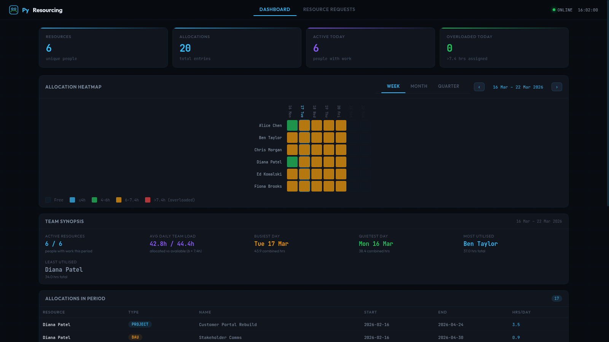
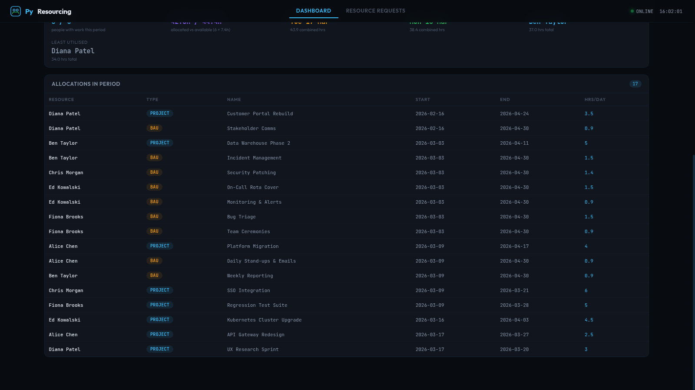
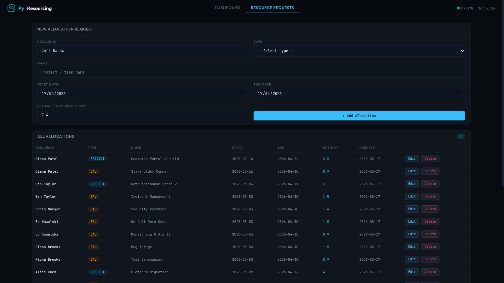

# Py Resourcing
**Lightweight Team Resource & Capacity Management Tool**

Installation & Configuration Guide
Version 1.0 | March 2026
Technology Services | Middleware Platform Team

---

## Screenshots

### Dashboard — Allocation Heatmap & Team Synopsis



> **① Navigation bar** — switch between Dashboard and Resource Requests. Online status and live clock top-right.
>
> **② Stat cards** — at-a-glance counts for total resources, allocations, people active today, and anyone exceeding 7.4 hrs (overloaded).
>
> **③ Allocation Heatmap** — resources listed down the left, dates across the top. Use the **Week / Month / Quarter** selector and **‹ ›** arrows to navigate the timeline. Colour key: blue ≤4h · green 4–6h · amber 6–7.4h · red >7.4h (overloaded). Weekends are shown greyed out with no colour.
>
> **④ Team Synopsis** — auto-calculated for the visible period: active resource count vs. total, average daily team load vs. full availability (resources × 7.4h), busiest and quietest weekdays, and most/least utilised resource.

---

### Dashboard — Allocations in Period Table



> **⑤ Allocations in Period** — all allocation records that overlap the currently selected heatmap window, sorted by start date. The badge shows the count. Updates automatically when you change the view or navigate periods.

---

### Resource Requests



> **⑥ New Allocation Request form** — six fields: Resource (pre-filled from your saved name), Type (Project / BAU), Name, Start Date, End Date, and Estimated Hours per Day (default 7.4, increments of 0.1).
>
> **⑦ All Allocations table** — full list of every allocation with **Edit** and **Delete** per row. Edit opens a modal pre-filled with the existing values.

---

## Table of Contents

1. [Prerequisites](#1-prerequisites)
2. [Install Python](#2-install-python)
3. [Install Py Resourcing](#3-install-py-resourcing)
4. [First Start](#4-first-start)
5. [Command Line Options](#5-command-line-options)
6. [Usage Guide](#6-usage-guide)
7. [Data & Storage](#7-data--storage)

---

## 1. Prerequisites

Py Resourcing runs on any operating system with Python 3.10 or later. It has **zero mandatory dependencies** — the Python standard library is all that is required.

### 1.1 System Requirements

| Component | Minimum |
|-----------|---------|
| OS        | Any OS with Python 3.10+ (Linux, macOS, Windows) |
| CPU       | 1 core  |
| RAM       | 256 MB  |
| Disk      | 50 MB   |
| Network   | Local only (no external access required) |
| Python    | 3.10+   |

### 1.2 Firewall Ports

| Port | Direction | Purpose |
|------|-----------|---------|
| 8460 | Inbound TCP | Web dashboard and REST API |

---

## 2. Install Python

### 2.1 RHEL / CentOS / Rocky Linux 8+

```bash
sudo dnf install python3 python3-pip
```

Verify:
```bash
python3 --version
```

### 2.2 Ubuntu 22.04 / 24.04 / Debian 12+

```bash
sudo apt update
sudo apt install python3 python3-pip
```

Verify:
```bash
python3 --version
```

### 2.3 macOS

```bash
brew install python3
```

### 2.4 Windows

Download Python 3.10+ from [python.org](https://www.python.org/downloads/) and ensure `python` is added to your PATH during installation.

---

## 3. Install Py Resourcing

### 3.1 Create Application Directory

```bash
mkdir -p /opt/pyresourcing
cd /opt/pyresourcing
```

### 3.2 Download

Copy `pyresourcing.py` to the application directory. This is the **only file required**.

```bash
# From GitHub:
curl -o pyresourcing.py https://raw.githubusercontent.com/robinmiles1/Py-Resourcing/master/pyresourcing.py

# Or clone the repo:
git clone https://github.com/robinmiles1/Py-Resourcing.git
cd Py-Resourcing
```

### 3.3 Verify Directory Structure

After installation the directory should look like this:

```
/opt/pyresourcing/
│
└── pyresourcing.py          ← Main application (single file)
```

The following are created automatically on first startup:

```
/opt/pyresourcing/
├── pyresourcing.py
└── pyresourcing.db          ← SQLite database (auto-created)
```

---

## 4. First Start

### 4.1 Start Py Resourcing

```bash
cd /opt/pyresourcing
python3 pyresourcing.py
```

On first start, Py Resourcing will:
- Create the SQLite database (`pyresourcing.db`) in the same directory
- Start the web dashboard on port **8460**

You should see the startup banner:

```
╔══════════════════════════════════════════╗
║         Py Resourcing  v1.0              ║
║──────────────────────────────────────────║
║  Dashboard : http://localhost:8460       ║
║  Database  : pyresourcing.db             ║
╚══════════════════════════════════════════╝
```

### 4.2 Access the Dashboard

Open a web browser and navigate to:

```
http://<server-ip>:8460
```

On first visit you will be prompted to enter your name. This is stored locally in your browser and used to pre-fill the **Resource** field when creating allocations.

### 4.3 Run as a Background Service (Linux)

To keep Py Resourcing running after you close your terminal, create a systemd service:

```bash
sudo tee /etc/systemd/system/pyresourcing.service > /dev/null <<EOF
[Unit]
Description=Py Resourcing — Team Resource Manager
After=network.target

[Service]
ExecStart=/usr/bin/python3 /opt/pyresourcing/pyresourcing.py
WorkingDirectory=/opt/pyresourcing
Restart=always
RestartSec=5

[Install]
WantedBy=multi-user.target
EOF

sudo systemctl daemon-reload
sudo systemctl enable --now pyresourcing
sudo systemctl status pyresourcing
```

---

## 5. Command Line Options

| Flag | Default | Description |
|------|---------|-------------|
| `--port PORT` | `8460` | HTTP port to listen on |
| `--db PATH` | `./pyresourcing.db` | Path to SQLite database file |

Examples:

```bash
# Custom port
python3 pyresourcing.py --port 9000

# Custom database location
python3 pyresourcing.py --db /data/team.db

# Both
python3 pyresourcing.py --port 9000 --db /data/team.db
```

---

## 6. Usage Guide

### 6.1 Dashboard

The dashboard provides a full overview of team capacity for the selected period.

**Heatmap**
- Resources are listed down the left, dates across the top
- The timeline can be viewed as **Week**, **Month**, or **Quarter** using the selector
- Use the **‹** and **›** buttons to navigate backwards and forwards in time
- Hover over any cell to see a tooltip with the resource name, date, total hours, and individual allocation names
- Weekends are displayed but greyed out

**Heatmap colour key:**

| Colour | Hours |
|--------|-------|
| Empty (dark) | No allocation |
| Blue | Up to 4 hours |
| Green | 4 – 6 hours |
| Amber | 6 – 7.4 hours |
| Red | Over 7.4 hours (overloaded) |

**Stat Cards**

| Card | Description |
|------|-------------|
| Resources | Total unique resources with any allocation |
| Allocations | Total allocation entries |
| Active Today | Resources with work assigned today |
| Overloaded Today | Resources exceeding 7.4 hrs today |

**Team Synopsis**

Displayed below the heatmap for the current period:
- **Active Resources** — people with at least one allocation vs. total
- **Avg Daily Team Load** — combined hours allocated vs. total availability (resources × 7.4h)
- **Busiest Day** — weekday with highest combined team hours
- **Quietest Day** — weekday with lowest combined team hours
- **Most Utilised** — resource with highest total hours in the period
- **Least Utilised** — resource with lowest total hours in the period

### 6.2 Resource Requests

Use this page to create and manage allocations.

**Fields:**

| Field | Type | Description |
|-------|------|-------------|
| Resource | Text | Person's name (pre-filled from your saved name) |
| Type | Dropdown | `Project` or `BAU` |
| Name | Text | Project or task name |
| Start Date | Date | Allocation start |
| End Date | Date | Allocation end |
| Hours per Day | Number | Daily hours (0.1 increments, default 7.4) |

Each allocation can be **edited** or **deleted** from the table at the bottom of the page.

---

## 7. Data & Storage

All data is stored in a single SQLite database file (`pyresourcing.db`) in the application directory.

### 7.1 Backup

To back up all data, copy the database file:

```bash
cp /opt/pyresourcing/pyresourcing.db /backup/pyresourcing_$(date +%Y%m%d).db
```

### 7.2 Migrate to a New Server

```bash
# On the old server — stop the service and copy the database
scp /opt/pyresourcing/pyresourcing.db user@new-server:/opt/pyresourcing/

# On the new server — start normally
python3 pyresourcing.py
```

### 7.3 Schema

| Table | Purpose |
|-------|---------|
| `allocations` | All resource allocation records |

---

*Py Resourcing is a single-file Python application with zero mandatory dependencies.*
*Author: Robin Miles*
